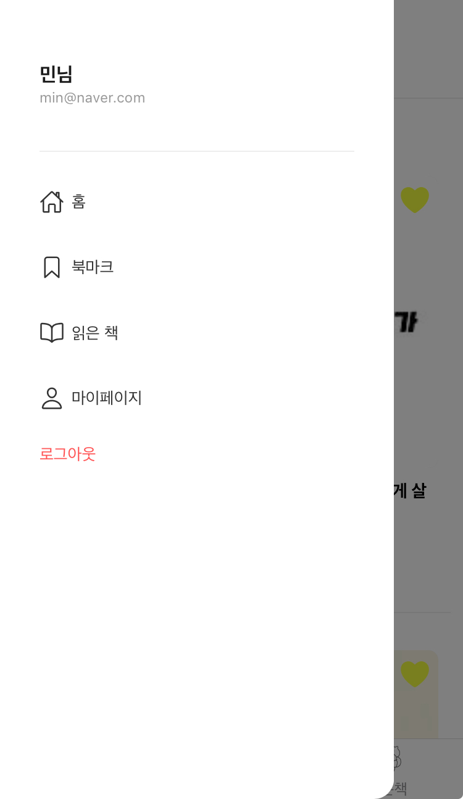
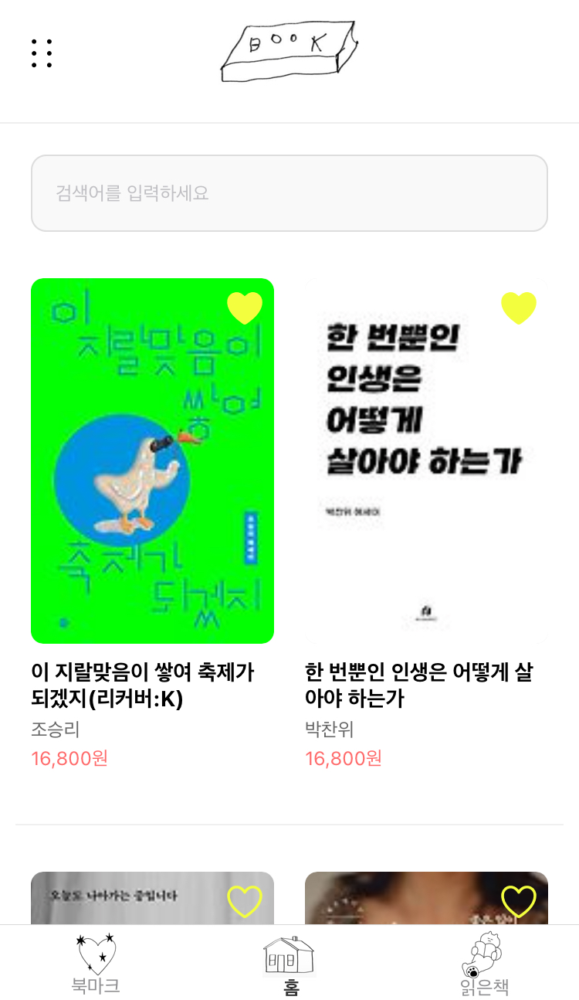
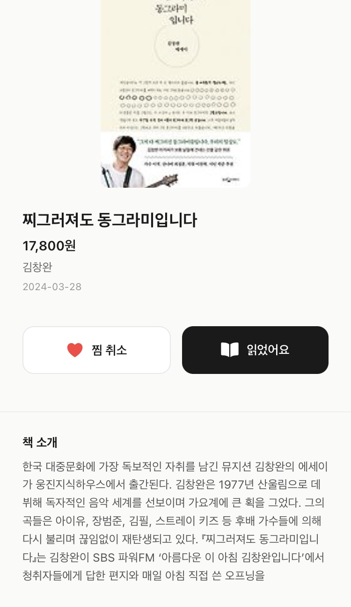
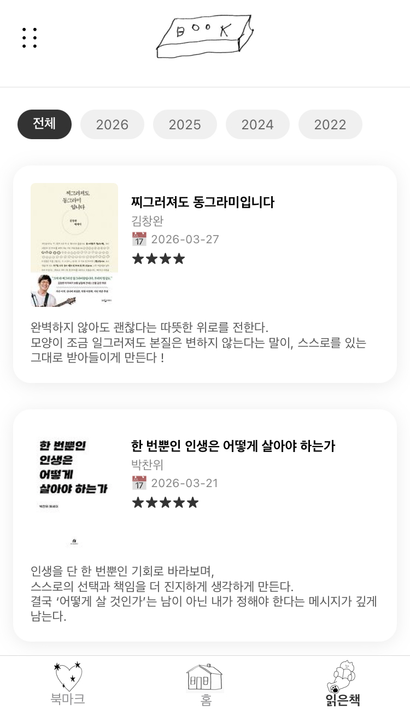
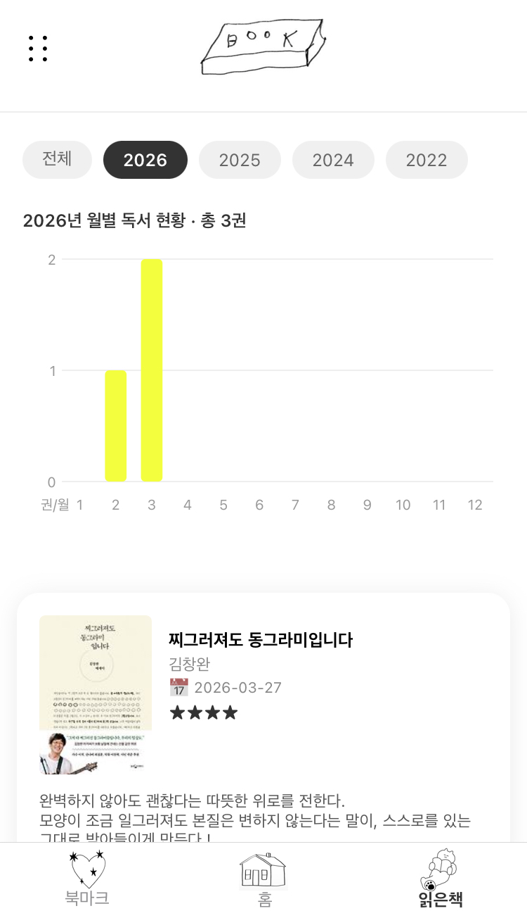
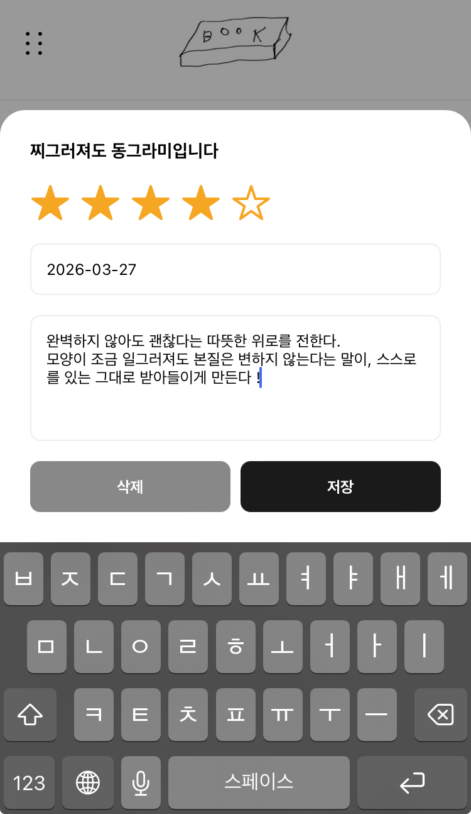
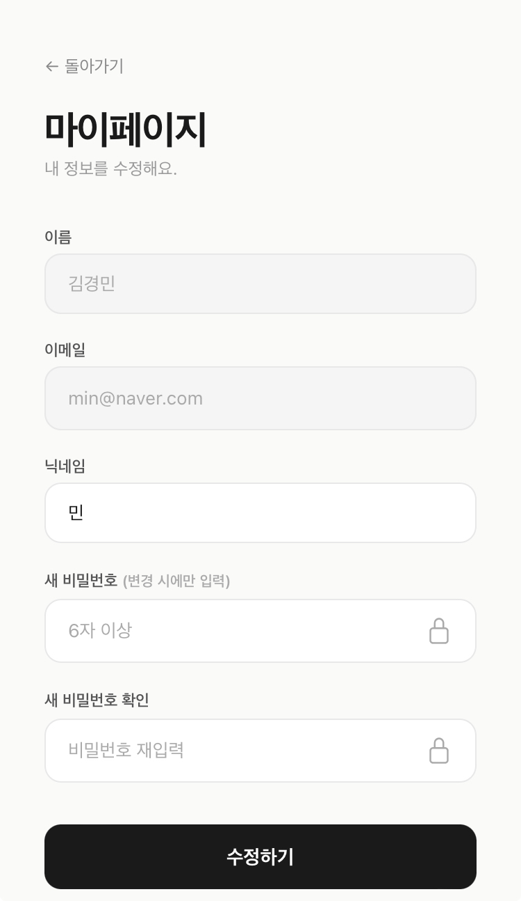
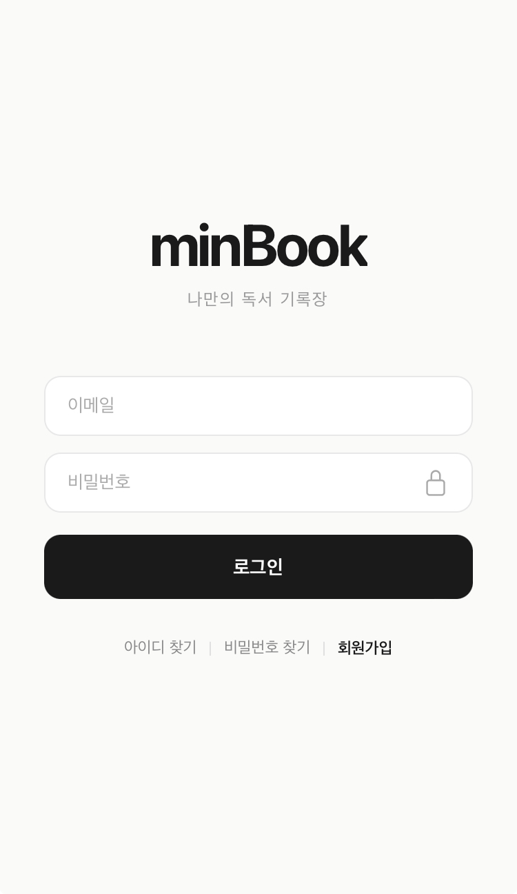
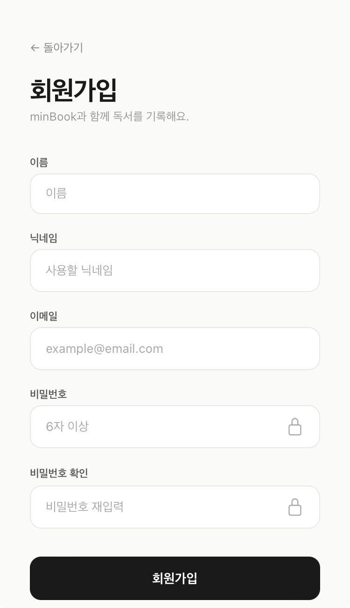

# 📖 프로젝트 소개 (minBook - App)
minBook App은 읽고 싶은 책을 저장하고, 읽은 책에 대한 느낀점을 기록할 수 있는 독서 기록 앱입니다.

홈 화면에서는 카카오 도서 검색 API를 통해 다양한 책 목록을 확인할 수 있으며,

관심 있는 책은 위시리스트에 저장하고 읽은 후에는 간단한 리뷰를 남길 수 있습니다.

독서를 더 편하고 기록하기 쉽게 만들기 위해 제작한 개인 프로젝트입니다.

<br/><br/>

## 💡 프로젝트를 만들게 된 계기

평소에 읽고 싶은 책이 생기면 아이폰 메모장에 따로 적어두는 습관이 있었습니다.

하지만 시간이 지나면서 메모가 늘어나고 정리가 어려워지는 불편함이 있었습니다.

그래서

> "읽고 싶은 책을 한 곳에서 관리하고, 읽은 책에 대한 기록도 남길 수 있는 앱을 직접 만들어보면 어떨까?"

라는 생각으로 공부도 할 겸 이 프로젝트를 시작하게 되었습니다.

<br/><br/>

## 🛠 기술 스택

- React Native (Expo)
- TypeScript
- Zustand
- Supabase (백엔드 구현 및 인증/DB 관리를 빠르게 처리하기 위해 사용)
- Kakao Book Search API (도서 검색 기능 구현) [링크](https://developers.kakao.com/docs/latest/ko/daum-search/dev-guide#search-book)

<br/><br/>

## Get started
1. Start the app

   ```bash
   npx expo start
   ```

2. Start the web (앱을 웹에서 확인하고 싶을 때)
    ```
   npx expo start --web
   ```

<br/><br/>

## App Image
<p align="center">
  
  
  
  <br><br>
  
  
  
  <br><br>
  
  
  
</p>

<br/><br/>


## ⚙️ 트러블슈팅 및 개선
- 웹 환경에서 빠르게 UI를 확인하며 개발을 진행하고, Expo Go를 통해 실제 디바이스에서 동작을 검증했습니다. 
이후 플랫폼 간 차이를 줄이기 위해 Xcode iOS 시뮬레이터(에뮬레이터)를 활용한 방법을 학습할 예정입니다.
- 감상평 작성 모달에서 텍스트 입력 시 키보드와 입력 영역이 겹치는 문제를 겪었고, 
이를 해결하기 위해 KeyboardAvoidingView를 적용하여 키보드 표시 여부에 따라 UI가 자동으로 조정되도록 개선했습니다.

<br/><br/>


## 📌 추후 기능 추가하고 싶은 리스트
- [ ] 1단계 - DB 설계 (Supabase)
  - follows 테이블 만들기 (follower_id, following_id)
  - profiles 테이블에 avatar_url, bio 컬럼 추가
  - 읽은책/찜한책 테이블에 created_at 확인 (피드 시간순 정렬용)

- [ ] 2단계 - 유저 프로필 페이지
  - 프로필 페이지 만들기 (/profile/[userId])
  - 닉네임, 읽은책 수, 찜한책 수 표시
  - 팔로우 / 언팔로우 버튼

- [ ] 3단계 - 팔로우 기능
  - useFollowStore 또는 React Query로 팔로우 상태 관리
  - 팔로우/언팔로우 토글 API 연결
  - 팔로워 / 팔로잉 목록 페이지

- [ ] 4단계 - 커뮤니티 피드 페이지
  - 햄버거바에 "커뮤니티" 메뉴 추가
  - 전체 유저 최근 활동 (읽은책) 타임라인으로 보여주기
  - 각 활동에 프로필 클릭 → 해당 유저 프로필로 이동

- [ ] 5단계  - 팔로잉 피드 (심화)
  - 커뮤니티에서 "전체" / "팔로잉" 탭 분리
  - 팔로잉한 사람들 활동만 필터링

- [ ] 6단계 - Vercel로 배포